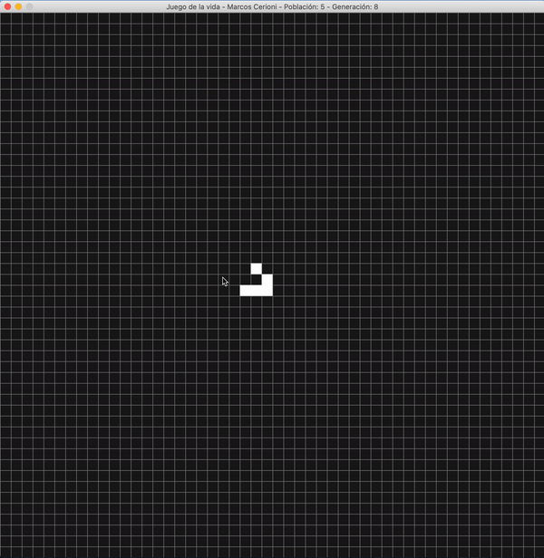
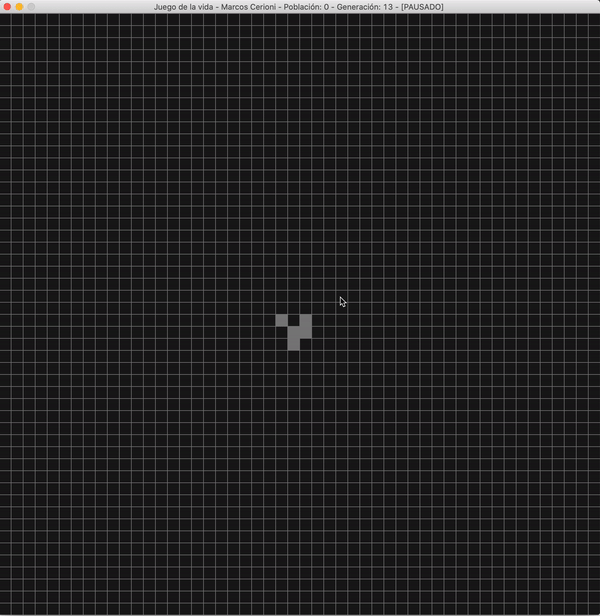

# Juego de la Vida

El **juego de la vida** es un autómata celular diseñado por el matemático **John Horton Conway** en 1970. 

El tablero es una malla plana formada por cuadrados (las "células") que se extiende por el infinito en todas las direcciones. Por tanto, cada célula tiene 8 células "vecinas", que son las que están próximas a ella, incluidas las diagonales. Las células tienen dos estados: están "vivas" o "muertas". El estado de las células evoluciona a lo largo de unidades de tiempo discretas. El estado de todas las células se tiene en cuenta para calcular el estado de las mismas al turno siguiente. Todas las células se actualizan simultáneamente en cada turno, siguiendo estas reglas:

-   Una célula muerta con exactamente 3 células vecinas vivas "nace" (es decir, al turno siguiente estará viva).
-   Una célula viva con 2 o 3 células vecinas vivas sigue viva, en otro caso muere (por "soledad" o "superpoblación").

## Instalación

 1. Clonar el repositorio: 

    `git clone https://github.com/marcoscerioni/JuegoDeLaVida.git`
 
 2. Ingresar a la carpeta del repo:
             
       `cd JuegoDeLaVida`
 
 3. Instalar [pygame](https://www.pygame.org/wiki/GettingStarted). 
 
 4. Instalar [numpy](https://www.scipy.org/install.html). 
 
 5. Compilar el juego:

     `python3 juegoVida.py`

## Jugabilidad

 - Cuando corremos el último comando, va a aparecer algo de la forma: 

    
 
 - Al **presionar cualquier tecla** se va a **pausar** el juego. Arriba en el título va a aparecer "PAUSADO" y se va a pintar de otro color las celdas "vivas". 
 - A su vez, al **apretar el click izquierdo**, se pueden "**revivir / nacer**" nuevas celdas, y al **apretar el click derecho** se van a "**morir**" esas celdas seleccionadas; como se muestra en el siguiente gif:

    